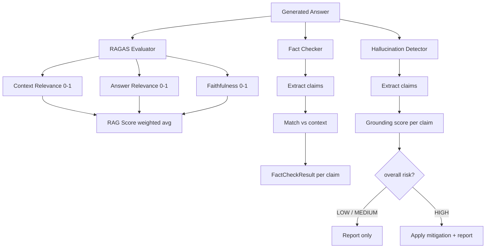

# Workflows

This document covers every pipeline and process flow in the system. For static component and module diagrams, see [ARCHITECTURE.md](./ARCHITECTURE.md).

> **Learning context:** Read this document after [AI_LEARNING_GUIDE.md](./AI_LEARNING_GUIDE.md) PART 7 (The Complete RAG Pipeline). The code-level steps here map directly to the concepts taught in the guide.
>
> **How to use this document:**
> - §1 (Data Loading) + §2 (Standard Query) are the most important — read these first.
> - §6 (Evaluation Pipeline) pairs with AI_LEARNING_GUIDE.md §4.
> - §7 (State Lifecycle) explains CLI session behaviour.
> - §8 (CLI Command Routing) is a quick reference for the command handler code.
>
> **If you are brand new:** Start with [LEARNING_PATH.md](./LEARNING_PATH.md).
>
> **After this document:** Read [ARCHITECTURE.md](./ARCHITECTURE.md) for the component-level view.

---

## Quick Overview: How The System Works

**When you ask a question, here's what happens:**

1. **Your question enters the system** → RAGSystem.process_query()
2. **System searches for relevant information:**
   - Hybrid search: 70% semantic (vector similarity) + 30% keyword (BM25)
   - Retrieves top 3-5 document chunks from loaded sources
   - Optionally reranks with cross-encoder for better precision
3. **System builds a prompt for the LLM:**
   - System instructions: "Answer using only the provided context"
   - Retrieved document chunks (the "context")
   - Conversation history (for follow-ups)
   - Your question
4. **LLM generates an answer** using only the provided context
5. **System evaluates the answer:**
   - RAGAS metrics measure quality (context relevance, answer relevance, faithfulness)
   - Optional: fact-checking, hallucination detection, passage highlighting
6. **You receive the answer** with source citations and quality metrics

**The sections below provide code-level detail for each of these steps.**

---

## 1. Data Loading

Triggered by: `load <source>`

```
User: load wikipedia "Machine Learning"
             |
             v
     MultiSourceDataLoader.load(source)
             |
             v
     Detect source type:
       http/https?  --> requests + BeautifulSoup
       .pdf?        --> PyPDF2 page extraction
       local path?  --> open() file read
       default      --> Wikipedia API
             |
             v
     Raw text content
             |
             v
     AdaptiveChunker.chunk(content)
       Detect content type:
         Academic text    --> 800 tokens, 200-token overlap
         Structured data  --> 300 tokens,  50-token overlap
         General prose    --> 500 tokens, 100-token overlap
       Split at sentence boundaries
             |
      +------+------+
      v             v
 ChromaDB          BM25
 Embed each        Tokenize each
 chunk + store     chunk, build
 with metadata     inverted index
             |
             v
     State update:
       collections[name] = chroma_collection
       loaded_sources[source] = source_type
       domain_guard.update_profile(chunks)  <-- builds domain
```

---

## 2. Standard Query

Triggered by: `query <question>` (or any unrecognised input)

### Overview

```
User input
    |
    v
[Self-Query Decomposer]  -- if enabled
    |
    v
[Domain Guard]           -- if enabled
    |
    v
[Embedding Cache]
    |
    v
[Hybrid Search]
    |
    v
[Document Reranker]      -- if enabled
    |
    v
[LLM Generation]
    |
    v
[Passage Highlighter]    -- if enabled
    |
    v
[RAGAS Evaluation]       -- always runs
    |
    v
[Fact Checker]           -- if enabled
    |
    v
[Hallucination Detector] -- if enabled
    |
    v
Response + persist to JSON
```

### Detailed steps

**Step 1 — Self-Query Decomposition** (`self-query` toggle)

```
SelfQueryDecomposer.decompose(query)

  Is query multi-aspect?
    No  --> use original query unchanged
    Yes --> extract N focused sub-queries
            e.g. "What is ML, its types, and healthcare uses?"
            --> ["What is machine learning?",
                 "What are the types of machine learning?",
                 "How is ML applied in healthcare?"]

  Sub-queries are merged before retrieval so all aspects
  are covered in a single generation call.
```

**Step 2 — Domain Guard** (`domain` toggle)

```
DomainGuard.check(query)

  Compute cosine_similarity(embed(query), domain_profile)
  domain_profile = centroid of all loaded chunk embeddings

  similarity >= threshold (0.35) --> proceed normally
  similarity <  threshold        --> DomainCheckResult(is_in_domain=False)
                                     display warning to user
                                     still proceed (warning only, not a block)
```

**Step 3 — Embedding Cache**

```
EmbeddingCache.get(query_text)

  Cache hit  --> return stored embedding vector   (O(1), <1 ms)
  Cache miss --> ChromaDB computes embedding
             --> store in LRU cache for future use
```

**Step 4 — Hybrid Search**

```
HybridSearchEngine.retrieve(query, n_results=3)

  Semantic search (70% weight):
    ChromaDB.query(embedding)
    Returns docs with cosine distance scores

  Keyword search (30% weight):
    NLTK tokenize query
    BM25.get_scores(tokens)
    Returns docs with BM25 scores

  Fusion:
    Normalise both score ranges to [0, 1]
    combined = 0.7 * semantic_score + 0.3 * keyword_score
    Deduplicate by content, sort descending
    Return top-k documents
```

**Step 4.5 — Document Reranking** (`rerank` toggle)

```
DocumentReranker.rerank(query, documents)

  Stage 1: Cross-Encoder Reranking (if use_cross_encoder=True)
    For each query-document pair:
      CrossEncoder.predict([(query, doc.text)])
      Score ranges from -10 to +10
      Convert to distance: distance = 1.0 - (score / 10.0)
    Update document distances with cross-encoder scores

  Stage 2: MMR Diversity Filter (if use_mmr_diversity=True)
    selected = []
    candidates = all_documents
    while len(selected) < max_results:
      For each candidate in candidates:
        mmr_score = λ × relevance - (1-λ) × max_similarity_to_selected
        where λ = mmr_lambda (default 0.7)
      Pick highest mmr_score candidate
      Move to selected, remove from candidates

    Jaccard similarity for diversity:
      similarity = |A ∩ B| / |A ∪ B|
      A, B = word sets from document texts

  Return reranked top-k documents
  Typical: Retrieve 50 candidates → Rerank to top 5
```

**Step 5 — Generation**

```
LLMAnswerGenerator.generate(query, docs, history)

  Build prompt:
    system: grounding instructions
    context: formatted retrieved chunks
    history: last N conversation turns
    user: the question

  OpenAI API call
    temperature: 0.2
    max_tokens: 1000
    stream: True/False depending on 'streaming' toggle

  Returns answer text
```

**Step 5.5 — Passage Highlighting** (`highlight` toggle)

```
PassageHighlighter.extract_relevant_passages(query, answer, documents)

  For each document:
    1. Sentence tokenization with NLTK sent_tokenize()
    2. For each sentence:
         Calculate relevance score:
           query_keywords = extract_keywords(query)
           answer_keywords = extract_keywords(answer)
           sentence_keywords = extract_keywords(sentence)

           query_overlap = |sentence ∩ query| / |query|
           answer_overlap = |sentence ∩ answer| / |answer|
           doc_boost = 0.3 if from_top_ranked_doc else 0.0
           phrase_bonus = 0.1 if exact_phrase_match else 0.0

           score = (query_overlap × 0.6) +
                   (answer_overlap × 0.4) +
                   doc_boost +
                   phrase_bonus
    3. Select top N sentences per document (default: 3)
    4. Return HighlightedPassage[] with:
       - text: sentence content
       - source: document identifier
       - relevance_score: computed score
       - sentence_index: position in original document

  Store in RAGResponse.highlighted_passages
  Display via 'passages' command
```

**Step 6 — RAGAS Evaluation** (always active)

```
RAGASEvaluator.evaluate(query, context, answer)

  Context Relevance (0–1)
    LLM judges: are the retrieved docs relevant to the query?
    Formula: relevant_docs / total_docs

  Answer Relevance (0–1)
    cosine_similarity(embed(query), embed(answer))

  Faithfulness (0–1)
    For each sentence in answer:
      Is it supported by the retrieved context?
    Formula: supported_claims / total_claims

  RAG Score (0–1)
    0.25 * context_rel + 0.35 * answer_rel + 0.40 * faithfulness
```

**Step 7 — Fact Checker** (`fact-check` toggle)

```
FactChecker.check_answer(answer, context)

  1. Parse answer into individual factual claims
  2. For each claim:
       Search context for supporting passages
       Score similarity (direct quote vs paraphrase)
       Flag if context contradicts claim
  3. Return FactCheckResult[] per claim
     - is_supported: bool
     - confidence: float
     - supporting_passages: list[str]
```

**Step 8 — Hallucination Detection** (`hallucination` toggle)

```
HallucinationDetector.analyze(answer, context)

  1. Extract all factual claims from answer
  2. For each claim:
       best_score = max(cosine_sim(embed(claim), embed(chunk))
                        for chunk in context)
       grounded = best_score >= grounding_threshold
  3. Aggregate:
       grounding_score = grounded_claims / total_claims
       risk_level:
         LOW    if grounding_score >= 0.80
         MEDIUM if grounding_score >= 0.60
         HIGH   if grounding_score <  0.60
  4. If risk is HIGH and auto_mitigate is True:
       Regenerate answer with stronger grounding prompt
  5. Return HallucinationReport
```

---

## 3. Query Expansion

Triggered by: `expand <query>`

```
User: expand "What caused the French Revolution?"
             |
             v
     QueryExpander.expand(query, n=4)
       Generate 4 variations:
         1. Rephrase with synonyms
         2. Add specificity / narrow the scope
         3. Add context / broaden the scope
         4. Alternative angle or phrasing
             |
             v
     process_query(query, use_expansion=True)
       Run hybrid search for each variation (4 searches)
       Collect all retrieved documents
       Deduplicate by content hash
       Re-rank by combined relevance score
             |
             v
     LLM generates answer from the expanded document set
             |
             v
     RAGAS evaluation + optional fact-check + hallucination detection
```

---

## 4. Multi-Hop Reasoning

Triggered by: `multihop <query>`

```
User: multihop "How did Einstein's work lead to nuclear energy?"
             |
             v
     MultiHopReasoner.decompose(query, max_steps=3)

       LLM breaks query into N sequential sub-questions:
         Step 1: "What was E=mc²?"
         Step 2: "How does mass-energy equivalence relate to nuclear fission?"
         Step 3: "How was nuclear fission applied to generate energy?"
             |
             v
     For each sub-question (sequential):
       Hybrid search  --> retrieve top-2 docs
       Collect context for this step
             |
             v
     MultiHopReasoner.synthesize(query, step_results)
       LLM receives: original query + all step contexts
       Generates comprehensive final answer
             |
             v
     Display: decomposition steps + synthesized answer
```

---

## 5. Self-Query Decomposition (standalone flow)

When `self-query` is toggled on, it wraps every `query` call:

```
Complex query: "What is ML, what are its types, and where is it used?"
             |
             v
     SelfQueryDecomposer.decompose(query)

     Complexity detected (multiple conjunctions/aspects)
             |
             v
     Extract aspects:
       "What is machine learning?"
       "What are the types of machine learning?"
       "Where is machine learning used?"
             |
             v
     For each sub-query: hybrid search --> collect docs
     Merge all retrieved documents (deduplicated)
             |
             v
     Single LLM call with merged context
       Display: sub-query breakdown + unified answer
```

---

## 6. Evaluation Pipeline

Both RAGAS and hallucination detection run after every generated answer (when enabled). They share the same inputs.



---

## 7. System State Lifecycle

```
[INIT]
  Load config from .env
  Connect ChromaDB PersistentClient
  Connect OpenAI client
  Instantiate all components
  State: current_collection=None, collections={}, loaded_sources={}
       |
       v
[READY — no sources]
  Only commands available: load, help, quit/exit
       |
       | load <source>
       v
[LOADING]
  Fetch → chunk → index ChromaDB → build BM25 → update domain profile
  State: collections[name]=..., loaded_sources[source]=type
       |
       v
[READY — sources loaded]
  All commands available
       |
       | query / expand / multihop
       v
[PROCESSING]
  Optional: self-query decompose → domain check → cache lookup
  Hybrid search → generate → evaluate → optional safety checks
  Append to conversation_history
       |
       +---> back to [READY — sources loaded]
       |
       | clear
       +---> back to [READY — no sources]
       |
       | quit / exit
       v
[SHUTDOWN]
  Optional: save conversations to JSON
```

---

## 8. CLI Command Routing

```
User input
    |
    v
cmd = input.lower().split()[0]
    |
    +-- quit / exit       --> shutdown
    +-- help              --> print help text
    +-- load              --> _handle_load()  --> RAGSystem.load_data()
    +-- query             --> _handle_query() --> RAGSystem.process_query()
    +-- expand            --> _handle_expand() --> QueryExpander + process_query()
    +-- multihop          --> _handle_multihop() --> MultiHopReasoner
    +-- sources           --> print loaded_sources
    +-- history           --> print conversation_history
    +-- metrics           --> print evaluation_results
    +-- cache             --> print EmbeddingCache stats
    +-- facts             --> print last FactCheckResult[]
    +-- hallucination-report --> print last HallucinationReport
    +-- domain-stats      --> print DomainGuard profile
    +-- save              --> JSONStorage.export()
    +-- clear             --> conversation_history = []
    +-- streaming         --> toggle enable_streaming
    +-- fact-check        --> toggle enable_fact_checking
    +-- self-query        --> toggle config.reasoning.enable_self_query
    +-- domain            --> toggle config.search.enable_domain_guard
    +-- hallucination     --> toggle config.evaluation.enable_hallucination_detection
    +-- [anything else]   --> treated as a query (prepend "query ")
```

---

## 9. Caching Strategy

The system uses two independent caching layers:

**Embedding cache** (`src/retrieval/cache.py`)

```
Purpose: avoid recomputing embeddings for the same query text
Type:    LRU dict (OrderedDict), max 1000 entries by default
Key:     hash(query_text)
Value:   numpy embedding vector

Miss path: ChromaDB.embed(text) --> store in cache
Hit path:  return cached vector directly (<1 ms)
Metric:    EmbeddingCache tracks hits/misses; view with 'cache' command
```

**Source content cache** (`src/retrieval/loader.py`)

```
Purpose: avoid re-fetching the same URL/Wikipedia page in a session
Type:    in-memory dict, no eviction (session-scoped)
Key:     source identifier (page title / URL / path)
Value:   raw text string

Note: discarded at program exit; not persisted to disk
```

---

## 10. Error Recovery

| Failure point              | Behaviour                                              |
| -------------------------- | ------------------------------------------------------ |
| Wikipedia page not found   | Log warning, return empty string, notify user          |
| URL scraping fails         | Retry once; fallback to empty content                  |
| File not found             | Print clear error message, continue CLI loop           |
| PDF parse error            | Skip malformed pages, log error                        |
| LLM API error              | Log error, return "Unable to generate answer"          |
| RAGAS evaluation fails     | Skip metrics for this query, log warning               |
| Hallucination detect fails | Skip detection, log warning                            |
| ChromaDB connection fail   | Attempt reconnect; warn about potential data loss      |
| JSON save fails            | Log error, suggest new path, do not crash              |
| No sources loaded          | Return empty result with "load a source first" message |
